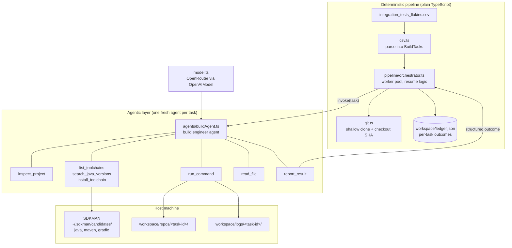
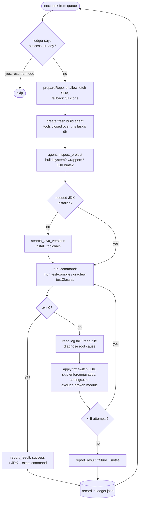

# Build Orchestrator — System Design

An agentic workflow that clones, sets up, and builds every `(project, sha)` pair in
`integration_tests_flakies.csv`, so their test suites become runnable for flaky-test research.

## Design philosophy

The system splits work by a single rule:

> **Deterministic work is plain code. Only the fuzzy work goes to the LLM.**

Parsing the CSV, cloning repos, checking out SHAs, recording results — these are identical
for all 61 tasks, so an LLM would add cost and nondeterminism for no benefit. What *differs*
per project — which JDK an old commit needs, how to invoke its build, how to diagnose and fix
a failing build — is genuinely open-ended, and that's where the **build agent** lives.

## High-level architecture



## Per-task flow



## Why one fresh agent per task (not one big orchestrator agent)

A single agent looping over 61 projects would accumulate every build log in its context —
it would blow the context window by project ~5 and pay for all that history on every model
call. Instead the **orchestrator is code** and each task gets a **fresh agent** whose tools
are closed over that task's checkout directory. Benefits:

- **Context isolation** — task 40 doesn't pay for task 1's logs.
- **Sandboxing** — `run_command` / `read_file` refuse paths outside the task's checkout, so an
  agent physically can't touch another task's repo.
- **Parallelism** — `--concurrency N` runs N independent agents. Tasks of the *same* project
  are serialized within one worker (two checkouts running `mvn install` of the same SNAPSHOT
  version would race in the shared `~/.m2` and corrupt its metadata); only different projects
  run concurrently.
- **Crash containment** — one agent erroring is one `error` row in the ledger, not a lost run.

## The tools

| Tool | Kind | Purpose |
|---|---|---|
| `inspect_project` | deterministic scan | One-shot facts: Maven/Gradle, wrappers, JDK hints from build files, CI config. Saves the agent 5–10 exploratory turns. |
| `list_toolchains` | read | What JDK/Maven/Gradle versions SDKMAN already has. |
| `search_java_versions` | read | Real, installable Temurin version ids for a major version (8 → `8.0.442-tem`). Prevents the agent hallucinating version ids. |
| `install_toolchain` | write | `sdk install java/maven/gradle <version>`, non-interactive. |
| `run_command` | write | The workhorse. Bash in the checkout, hard timeout, `javaVersion` param sets `JAVA_HOME` per-command. Full output → log file on disk; only the tail goes back into the model's context. Denylist blocks `sudo`, `git push`, `rm -rf /`, etc. |
| `read_file` | read | Windowed reads of poms and the on-disk command logs, so big files never flood the context. |
| `report_result` | structured output | The agent's **required** last call. The closure captures a typed `AgentReport` — the orchestrator never parses prose. |

## Key mechanisms

**Context budget management.** Build logs from Maven multi-module builds run to megabytes.
`run_command` writes the full output to `workspace/logs/<task-id>/run-NNN/<seq>.log` (a fresh
`run-NNN` directory per attempt, so re-runs never overwrite history) and returns only the
last ~12 KB to the model. If the error is higher up, the agent pages through the log file with
`read_file`. This is the difference between the workflow surviving Quarkus and dying on it.

**Per-command JDK switching.** SDKMAN installs JDKs side by side under
`~/.sdkman/candidates/java/<id>`. Rather than mutating global state, `run_command` takes a
`javaVersion` and sets `JAVA_HOME`/`PATH` for that one command — so concurrent tasks can use
different JDKs simultaneously.

**Structured hand-off.** Success/failure is not inferred from the agent's final message.
The `report_result` tool's Zod schema forces `{status, buildTool, jdkVersion, testCompileCommand, notes}`,
and the closure hands it to the orchestrator. If the agent never calls it, the task is recorded
as `error`, distinct from an honest `failure`.

**Resumability.** Every outcome lands in `workspace/ledger.json` immediately. Re-running skips
prior successes (override with `--fresh`). A run interrupted at task 30 restarts at task 31 —
important when a full pass over 61 projects takes hours.

**Cheap clones.** `git fetch --depth 1 origin <sha>` pulls just the one commit (GitHub permits
fetching arbitrary SHAs), with automatic fallback to a full clone. This keeps 61 checkouts —
including monsters like quarkus and CoreNLP — from eating the disk.

## Module map

```
src/
├── index.ts                 CLI: flags, task selection, summary
├── config.ts                .env → typed config (model, timeouts, paths)
├── model.ts                 OpenRouter model factory (OpenAI-compatible API)
├── types.ts                 BuildTask, AgentReport, BuildOutcome, Ledger
├── csv.ts                   CSV → BuildTask[]
├── exec.ts                  runShell(): spawn + timeout + capture; SDKMAN paths
├── git.ts                   prepareRepo(): shallow fetch SHA, fallback clone
├── ledger.ts                load/record outcomes (JSON on disk)
├── pipeline/
│   └── orchestrator.ts      worker pool, resume, per-task lifecycle
├── agents/
│   └── buildAgent.ts        system prompt + agent factory (fresh per task)
└── tools/
    ├── inspect.ts           inspect_project
    ├── toolchain.ts         list/search/install via SDKMAN
    ├── shell.ts             run_command (sandboxed, logged, denylisted)
    ├── files.ts             read_file (windowed, path-restricted)
    └── report.ts            report_result (typed outcome capture)
```

## Extension points

- **New agent roles** — e.g. a `testRunnerAgent` that takes a successful ledger entry and runs
  a specific flaky test N times. Same pattern: factory + task-scoped tools + report tool.
- **Different model per role** — `model.ts` is a factory; a cheap model for inspection and a
  strong one for failure diagnosis is a one-line change.
- **Docker isolation** — replace `exec.ts`'s `runShell` with `docker exec` into a per-task
  container; every tool above it is unchanged.
